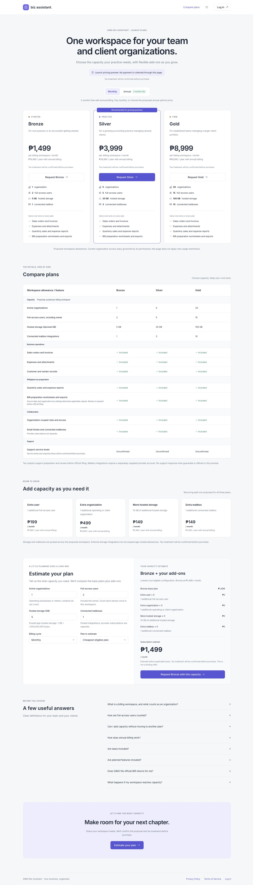

# Public launch pricing preview

The public `/pricing` route offers the `2026-10-launch-proposal-v1` catalogue in PHP. The page presents proposed billing-workspace capacity, compares the same verified core tools across Bronze/Silver/Gold, estimates add-ons, and persists a private plan inquiry. It does not collect payment, provision a subscription, grant entitlements, or restrict existing tenants.

## Catalogue and arithmetic

`api/src/modules/pricing/pricing-domain.ts` is the single authoritative typed source for prices, limits, feature availability, inclusion, and pure estimation. Angular imports only this framework-independent domain and obtains the published catalogue from `GET /api/v1/pricing/catalogue`; no prices are separately maintained in templates. API builds retain the existing `dist/main.js` structure. The client build tree-shakes server catalogue constants when only types/calculation functions are used.

All billable amounts and saved subtotals are integer centavos. Annual prices equal ten monthly payments for twelve months, payable upfront. Only explanatory monthly equivalents are rounded for display; they never drive totals. Storage packs use `ceil(max(0, desiredGB - includedGB) / 10)`.

The required Silver example describes **total desired capacity**: 7 organizations, 8 users, 25 GB, 3 mailboxes. Silver needs 2 extra organizations and 3 extra users, yielding `399900 + 2*49900 + 3*19900 = 559400` centavos monthly and `5594000` annually. These are subscription subtotals before applicable taxes. The calculator compares every eligible plan rather than choosing Silver by default. Required-feature eligibility checks both available status and per-plan inclusion; required add-ons must be eligible on the plan.

Bounds are technical validation limits, not approved contractual ceilings: organizations/users 1–10,000 integers; mailboxes 0–10,000 integers; hosted storage 0–1,000,000 finite GB. Above 50 organizations or users, a larger Gold configuration needs discussion; any calculated amount remains nonbinding.

## Proposed subscription definitions

- The billing workspace is the paying firm/business account. Organizations remain distinct operating/client entities with isolated records; customers/vendors are contacts, not organizations.
- A billing-only parent uses no organization slot. The firm's own books use one if maintained as an organization.
- Each accepted, active full-access person, including the owner and client users who edit records, counts once per workspace across its organizations. The same person counts separately in independently paying workspaces. No free guest access is advertised.
- Workspace membership never grants blanket access to all organizations. Existing membership and permissions continue to govern access.
- Hosted storage and mailbox integration allowances are proposed pooled workspace capacity. GB means 1,000,000,000 bytes. External storage is not unlimited hosted capacity. Mailbox provider subscriptions are separate.

These definitions are proposed launch terms. Current licenses are organization-oriented; there is no verified billing-workspace owner/pooling/metering implementation. This task does not change their semantics or apply historical restrictions.

## Publication safeguards and feature evidence

Defaults are `launchMode: preview`, `ctaMode: request`, `taxDisplayMode: unconfirmed`, `trialEnabled: false`. `assertPreviewPublication` rejects live, checkout, confirmed tax modes, or trials on both API publication and client consumption. There is no environment/query/browser flag that enables purchasing. Implementing a live flow requires reviewed code and infrastructure evidence, rather than relaxing the assertion with a switch. No VAT percentage or tax registration is assumed; saved tax amounts are null.

Available status is independent of per-plan inclusion. All verified baseline features below are included in every proposal; planned/unverified features cannot gain included checkmarks or satisfy required-feature eligibility. Capacity allowances remain proposed even though their numeric records are authoritative for estimates. No roadmap promise is published.

| Public feature | Inspected implementation | Existing verification |
| --- | --- | --- |
| Sales orders and invoices | `api/src/services/order-workflow.js`, `sales-invoice-document.js`; order workspace and invoice pages | `order-workflow.test.js`, `order-invoice-payment.test.js`, `sales-invoice-document.test.js`, client order tests |
| Expenses and attachments | expense controller, expense calculation, organization-scoped upload/storage paths | `expenses-controller.test.js`, `expense-calculation.test.js`, expense-transfer and storage tests |
| Customer and vendor records | customer/vendor routes and pages, reference validation | `create-references.test.js`, `vendor-email.test.js`, client directory-search tests |
| Quarterly reports and BIR preparation worksheets/exports | reports controller, `bir-tax-return.js`, `bir-report-documents.js`, reports/BIR worksheet UI | `bir-tax-return.test.js`, `bir-report-documents.test.js`, client reports-year/BIR tests |
| Organization-scoped roles and access | authenticated organization scope, organization-role modules/routes, permission guards | organization isolation/access tests in order workflow, tax access, debt/ticket tests; client session tests |
| Email tickets/mailbox integration | email-ticket models, Gmail/Hostinger ticket services, tickets page | `email-tickets.test.js`, `hostinger-tickets.test.js`, `ticket-attachments.test.js`, client ticket-conversation tests |
| Support service levels | No verified operating policy found | Unverified, unconfirmed on all plans; no support guarantees |

These are repository implementation/test findings, not a claim that every deployed tenant has configured each integration. Applicable tax outputs depend on source data and organization settings. `PH-BIR-FILING-REPORTS-IMPLEMENTATION.md` distinguishes preparation/worksheets from final returns; current PDF/export support does not prove official filing or accreditation. Order payment records do not prove subscription checkout. No AI, OCR, bank sync, general ledger, client portal, automatic BIR filing, compliance guarantee, record-limit policy, or fake trial is advertised.

No application analytics integration was found. This page adds no tracking vendor or analytics containing contact/client financial information. Angular CLI analytics configuration is unrelated to product events.

## API and migration

| Endpoint | Access / behavior |
| --- | --- |
| `GET /api/v1/pricing/catalogue` | Public, `no-store`; catalogue, signed short-lived form challenge, configured canonical URL only. No inquiry/contact data. |
| `POST /api/v1/pricing/requests` | Public, `no-store`; validates contacts/UUID key/plan/cycle/quantities, recomputes estimate and snapshots catalogue version. Returns a receipt only after DB save or verified duplicate lookup. |
| `GET /api/v1/pricing/requests?page=1` | Existing authenticated **platform superuser** role only, including license/token checks from existing middleware. Organization administrators, accountants, ordinary users, and broad permissions do not qualify. 50 rows/page, bounded page input; excludes abuse/idempotency hashes. |

No public inquiry lookup, organization-ticket integration, request edit endpoint, subscription activation, or payment endpoint exists. The client public interceptor exception covers only catalogue GET and request POST; it does not bypass private inquiry GET or existing protected routes. Expiry/revocation still clears session and organization context; only the public `/pricing` route stays open instead of being redirected to login.

Apply `20261005030000-create-pricing-requests.js` through the existing migration runner in the review-approved target environment. It creates `pricing_requests` and `pricing_request_limits`; no organization/customer data is altered. Build does not run migrations. Rollback drops these new tables and their inquiry data; export needed inquiries before a rollback. No production migration has been run for this task.

Configuration:

- `PRICING_REQUEST_HASH_SECRET`: stable server-only random secret, at least 32 characters, shared across API instances. Generate using the command in `.env.example`. Without it, catalogue viewing still works but submission fails closed with 503. Changing it invalidates outstanding challenges and changes deduplication/rate identities; coordinate rotation operationally.
- `PRICING_REQUEST_TRUSTED_PROXY_IPS`: comma-separated exact IPs of verified reverse proxies. Empty trusts no forwarded identity and uses the socket address. The parser walks `X-Forwarded-For` from the socket toward the client and stops at the first untrusted hop; arbitrary client-supplied headers cannot evade limits. Configure the actual proxy chain and restrict direct API access before exposing request intake behind a proxy, otherwise visitors may share a proxy's abuse limit. No wildcard/CIDR/`true` trust setting is accepted.
- `APP_BASE_URL`: existing configured application base. Only a valid credential-free HTTPS origin produces a `/pricing` canonical link. There is no request-host fallback or invented public domain.

Abuse protections use a honeypot and HMAC-signed challenge aged 2 seconds–2 hours, 5 POST attempts/IP/UTC hour (including invalid payloads), and 3 valid attempts/email/UTC hour. MySQL row locks make rate counts atomic across processes; hashes retain no raw IP. These are inquiry abuse limits, separate from plan capacity. `Retry-After: 3600` is a conservative wait.

An idempotency key is hashed and protected by a UNIQUE DB index; changed payload on an existing key returns 409. Another UNIQUE fingerprint deduplicates identical normalized contact/selection/consent payloads within a UTC calendar day. Concurrent inserts return the existing saved receipt; duplicate attempts still consume abuse limits. Recoverable client errors retain entered fields and reuse the key for unchanged payloads. Request hashes are HMACs, not exposed by public endpoints. Expired abuse rows are cleaned in bounded batches.

Requests store only name, work email, optional firm name, separate optional marketing consent, authoritative selection/price/version snapshot, identifiers/hashes, and timestamps. No organization membership or billing rights are inferred. Requests are private contacts subject to an approved retention/access policy before operational launch. No retention period is invented here.

No verified sales recipient was configured for this task; no email notification was added, and the page never claims email was sent. Platform staff can retrieve saved requests through the protected endpoint. Follow-up notification automation must use the existing service only with a verified recipient and explicit operating approval.

## Live-launch blockers and future enforcement

1. Approve proposed prices, annual terms, and inclusive/exclusive tax wording; implement final server tax calculation before any payment.
2. Map existing organizations into explicit paying billing workspaces, with owner authorization, consent, and organization isolation preserved. Define treatment of legacy licenses without retrospective restrictions.
3. Implement server-side entitlements and reliable usage accounting for active accepted seats, organizations, decimal hosted bytes, and connected mailboxes. Use atomic reservations for concurrent additions/uploads; verify pooling and prevent over-allocation.
4. Implement and test payment, confirmed server-side activation, provisioning, retries, reconciliation, and allowlisted authentication return paths. Client selections, redirects, or browser flags cannot grant rights.
5. Approve support, cancellation, refunds, trials, archive/retention, and uptime policies. None is invented by this preview. Approve private inquiry retention and staff follow-up ownership; verify proxy abuse identity in the deployment.
6. Before enforcement, implement 80/90/100% usage warnings, explicit upgrade/add-on consent, and preservation of existing records and exports when optional processing capacity is exhausted. No tenant enforcement is shipped here.

## Verification

Pricing tests: `api/tests/pricing.test.js`, `pricing-http.test.js`, `pricing-mysql.integration.cjs`, and `client/tests/pricing.test.cjs`, plus `client/tests/session.test.cjs`. They cover all prices/capacities/savings/add-ons, storage rounding, invalid/bounded values, cheapest eligible recommendations, the Silver example, request prefill/loading/success/error and key reuse, forged client prices, anti-spam and forwarding spoofing, rate limiting, private reads, protected-route regression, publication guards, metadata and absence of fake signup/trial/checkout. Client behavior tests use real Angular reactive forms; Nest HTTP tests use a test repository/authentication dataset. The opt-in MySQL integration creates and drops its own random schema/user, verifies real migration up/down, persisted authoritative snapshots, unique duplicate arbitration, and concurrent multi-instance rate limiting.

Run focused tests and the MySQL check:

```sh
node --test api/tests/pricing.test.js api/tests/pricing-http.test.js client/tests/pricing.test.cjs client/tests/session.test.cjs
cd api
RUN_PRICING_MYSQL_INTEGRATION=1 node --test tests/pricing-mysql.integration.cjs
```

Full build uses `npm run build` under the repository-required Node 22. It produces the existing combined Hostinger release without connecting to a DB or deploying. Full regression command is `npm test`; results and browser evidence are recorded in the PR and the verification notes below.

### Verified results — 2026-10-05

- Node 22.23.3: complete production `npm run build` passed, including dependency installation, API compilation, Angular production compilation, standalone release assembly and production API dependencies. No pricing stylesheet budget warning remains. npm reported existing dependency deprecations; dependency upgrades are outside this task.
- Focused pricing/session tests: **25/25 passed**. Opt-in isolated MySQL integration: **1/1 passed** (migration up/down, real snapshots, idempotency/duplicates, concurrency and rate counts).
- Full repository `npm test`: **593 tests; 592 passed, 1 failed**. The failure is `client/tests/money-input.test.cjs` reporting `client/src/app/shared/bir-tax-return.component.html: missing money formatter`. Reproduced against an archive of unchanged base commit `53ed284` under Node 22: 7 passed, the same 1 failed. Those unrelated BIR files were not changed. CI's full test step is therefore expected to remain red until the baseline issue is separately fixed.
- Browser checks used the production Angular build with the actual Nest pricing module and real private MySQL persistence in a new temporary schema. Authentication/report datasets were synthetic local fixtures for navigation checks, not production login proof. Anonymous `/pricing` and direct refresh worked; anonymous `/orders` redirected to `/login`. After synthetic login, pricing navigation/refresh worked and unauthorized `/orders` still redirected to the permitted reports page.
- Browser estimator confirmed Silver at PHP 5,594/month and PHP 55,940/year. An injected recoverable server failure retained form values; retry succeeded only after the real DB save. Session tests also verify that public pricing stays open after expiry/revocation while protected pages still redirect. Submission locked while pending; native dialog Escape and success/close focus restoration worked. FAQ expanded from the keyboard; public comparison and privacy links worked.
- Desktop 1440×1000 (light/dark), tablet 768×1024 (annual), and narrow mobile 320×800 (annual) showed no page overflow or clipped prices. Comparison has an intentional separately scrollable table on small screens.
- No production migration, payment, provider activation, merge, or deployment was performed.

Screenshots from that local verification (synthetic data only):

| Desktop light | Desktop dark |
| --- | --- |
| [Full page](pricing-screenshots/desktop-light.jpg) | [Full page](pricing-screenshots/desktop-dark.jpg) |

[Mobile annual](pricing-screenshots/mobile-annual.jpg) · [Tablet annual](pricing-screenshots/tablet-annual.jpg) · [Persisted request success](pricing-screenshots/request-success.jpg)


